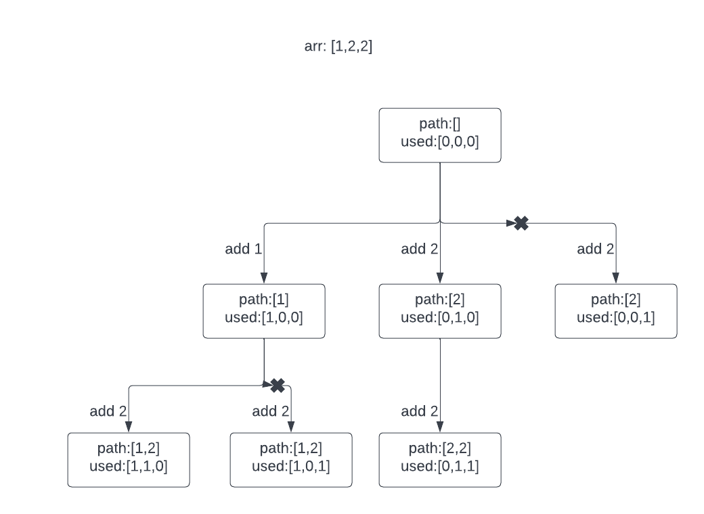

# Subsets

### Problem Statement

Given an integer array nums of unique elements, return all possible subsets (the power set).

The solution set must not contain duplicate subsets. Return the solution in any order.

### Key Takeaway

-   this array is of unique elements.

### Solution

Backtrack is a perfect solution to question that presents you with a fixed collection and asks you to give all its variants.

```java
class Solution {
    List<List<Integer>> res = new ArrayList<>();
    LinkedList<Integer> path = new LinkedList<>();
    public List<List<Integer>> subsets(int[] nums){
        // Rule out the corner case first
        if(nums.length == 0){
            res.add(path);
            return res;
        }

        backtrack(nums, 0);

        return res;
    }

    private void backtrack(int[] nums, int startIndex){
        res.add(new ArrayList<>(path));

        if(startIndex>=nums.length){
            return;
        }

        for(int i=startIndex; i<nums.length; i++){
            path.add(nums[i]);
            backtrack(nums, i+1);
            path.removeLast();
        }
    }
}
```

# Subsets II

### Problem Statement

Given an integer array nums that may contain duplicates, return all possible subsets (the power set).

The solution set must not contain duplicate subsets. Return the solution in any order.

### Key Takeaway

-   The array may contain duplicates.

### Solution

To avoid duplicates, it is important to figure out what kind of duplicates to avoid.

Firstly, the nums is sorted to make the duplicate value adjacent.

As backtrack can be represented as a tree, we will use a tree to demonstrate it.


As we can see, same value could not be added to the original path at the same level. Besides sorting the array, a boolean array is used to indicate the usage of the element of array

```java
class Solution {
    List<List<Integer>> res = new ArrayList<>();
    LinkedList<Integer> path = new LinkedList<>();
    boolean[] used;
    public List<List<Integer>> subsetsWithDup(int[] nums){
        // Rule out the corner case first
        if(nums.length == 0){
            res.add(path);
            return res;
        }

        // Sort the array
        Arrays.sort(nums);

        // initailize the used array
        used = new boolean[nums.length];

        backtrack(nums, 0);

        return res;
    }

    private void backtrack(int[] nums, int startIndex){
        res.add(new ArrayList<>(path));

        if(startIndex>nums.length){
            return;
        }

        for(int i=startIndex; i<nums.length; i++){
            // nums[i] == nums[i-1] means current element is the duplicate one and
            // used[i-1] == false indicate that they are at the same level
            if(i>0 && nums[i]==nums[i-1] && !used[i-1]){
                continue;
            }

            path.add(nums[i]);
            used[i] = true;
            backtrack(nums, i+1);
            path.removeLast();
            used[i] = false;
        }
    }
}
```
